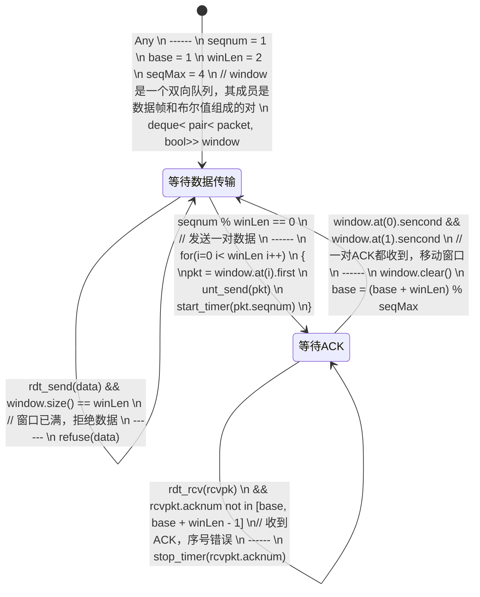
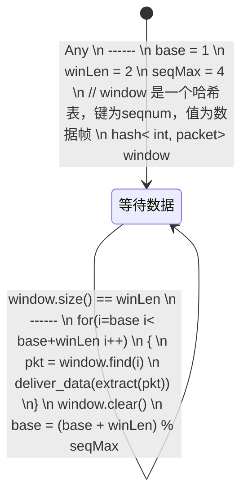
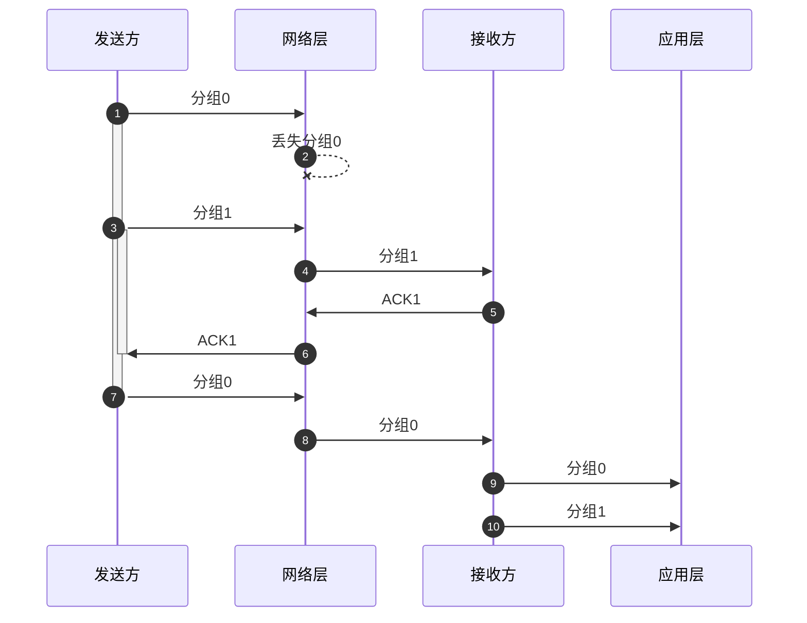

# 第三章

## P18

### 发送方 FSM

### 接收方 FSM

### 时序图

## P40

1. [1,6] 和 [23,26]
2. [6,16] 和 [17,22]
3. 3个冗余ACK
4. 超时
5. 32
6. 21
7. 14
8. 7
9. 4 7
10. 21 4
11. 52

## P45

1. 证明丢包率

    在这个周期中发送的数据包的总数量为：

    $$
    \begin{aligned}
    W_总 &= \frac{W}{2} + (\frac{W}{2} + 1)+ \dots + W
    \\  &= \sum\limits_{n=0}^{W/2}(\frac{W}{2} + n)
    \\  &= (\frac{W}{2} + 1) \cdot \frac{W}{2} + \frac{(0 + \frac{W}{2})\cdot(\frac{W}{2} + 1)}{2}
    \\  &= \frac{3}{8}W^2 + \frac{3}{4}W
    \end{aligned}
    $$

    只有一个数据包丢失，所以丢包率为：

    $$
    L =\frac{1}{\frac{3}{8}W^2 + \frac{3}{4}W}
    $$

2. 证明平均速率

    TCP连接速率在 $\frac{W}{2\cdot RTT}$ 和 $\frac{W}{RTT}$ 之间线性变化，所以平均连接速率是

    $$平均速率 = \frac{3\cdot W \cdot MSS}{4\cdot RTT} \space (\ast)$$

    由 `1.` 中的结论，有

    $$L =\frac{1}{\frac{3}{8}W^2 + \frac{3}{4}W}$$

    当 W 充分大时，有$L \approx \frac{8}{3\cdot W^2}$，即

    $$W \approx \sqrt{\frac{3\cdot L}{8}}$$

    代入 $(\ast)$ 式

    $$
    \begin{aligned}
    平均速率 & \approx \frac{3\cdot \sqrt{\frac{3\cdot L}{8}} \cdot MSS}{4\cdot RTT}
    \\ & \approx \frac{1.22 \cdot MSS}{RTT\sqrt{L}}
    \end{aligned}
    $$
