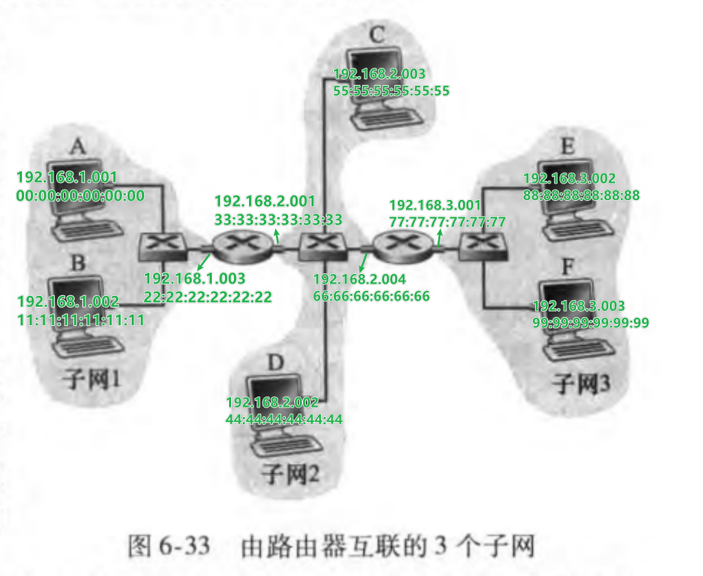

# 第六章

## P14

1. IP地址和网卡地址

    

2. 假设 ARP 表是最新的，从主机 E 向主机 B 发送一个 IP 数据报的过程是

   1. 寻找 IP 地址： E 的网络层转发表确认数据报应该路由到接口 `192.168.3.001` (右侧的路由器在子网 3 一侧的接口)。
   2. 寻找 MAC 地址： E 使用 ARP 算法，在 ARP 表中找到 `192.168.3.001` 对应的 MAC 地址为 `77:77:77:77:77:77`。
   3. 发送链路层帧： E 创建一个链路层帧（目的 MAC 地址为 `77:77:77:77:77:77`，包含寻址到 `192.168.1.002` 的网络层数据报）并发送。
   4. 接收链路层帧： 右侧路由器的适配器看到该链路层帧是向它寻址的，于是取出其中的数据报并上交给网络层。
   5. 路由器转发： 右侧路由器查询转发表，决定从子网 2 一侧的接口转发这个数据报。
   6. 重复上面的步骤，直到主机 B 收到数据报。

3. 假设 E 的 ARP 表是控的，从主机 E 向主机 B 发送一个 IP 数据报的过程是：

   1. 寻找 IP 地址： E 的网络层转发表确认数据报应该路由到接口 `192.168.3.001` (右侧的路由器在子网 3 一侧的接口)。
   2. 寻找 MAC 地址：E 使用 ARP 算法，在 ARP 表中没有找到 `192.168.3.001` 对应的 MAC 地址。
   3. 广播 ARP 查询：创建一个 ARP 查询分组并向 MAC 广播地址（`FF:FF:FF:FF:FF:FF`）发送。

        分组内容：

        ||发送方|接收方|
        |--|--|--|
        |IP|`192.168.3.002`|`192.168.3.001`|
        |MAC|`88:88:88:88:88:88`|`00:00:00:00:00:00`|

   4. 回应 ARP 查询：接口 `192.168.3.001` 发现其 IP 地址与 ARP 查询分组中接收方 IP 地址匹配，于是创建一个 ARP 响应分组，并向发送方 MAC 地址（`88:88:88:88:88:88`）发送。

        分组内容：

        ||发送方|接收方|
        |--|--|--|
        |IP|`192.168.3.001`|`192.168.3.002`|
        |MAC|`77:77:77:77:77:77`|`88:88:88:88:88:88`|

   5. 更新 ARP 表：E 根据 ARP 响应更新 ARP 表。
   6. 重复 `2.` 中剩余的操作。

## P18

在 t = 576 时，A 将完成数据帧的发送。

假设 B 也要传输，那么从 B 开始传输到 B 的数据帧到达 A 需要经过 325 比特时间。

那么如果 B 在 t = 324 时开始传输，A 将在 t = 324 + 325 = 649 时收到 B 的数据帧。此时 A 已经完成了传输，因此错误地认为没有发生碰撞。
